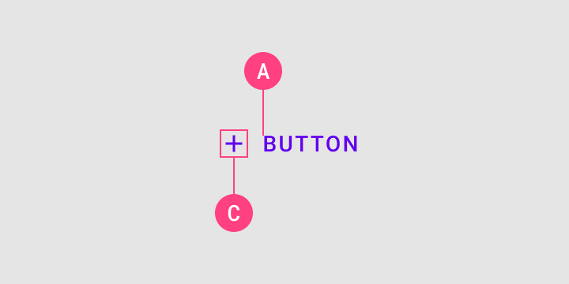
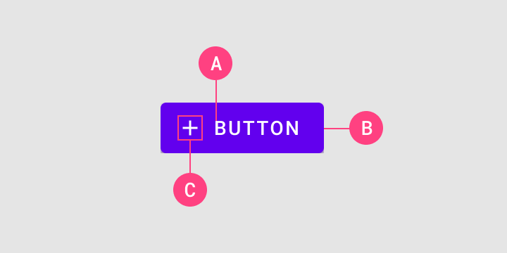

<!--docs:
title: "Buttons"
layout: detail
section: components
excerpt: "Android Buttons usage document"
ide_version: "<cIDE name> <compatible IDE version and build number>"
material_package_version: "<compatible Material platform package version number>"
iconId:
path: /
api_doc_root:
-->


# Buttons

[Buttons](https://material.io/components/buttons/) allow users to take actions, and make choices, with a single tap.

There are four types of buttons:

1. [Text button](#text-button)
2. [Outlined button](#outlined-button)
3. [Contained button](#contained-button)
4. [Toggle button](#toggle-button)


## Using buttons

<!-- Update your IDE and your Material Components library to the latest version if you are using Material Components for the first time. -->

Before you can use Material buttons, you need to add a dependency to the Material Components for Android library. For more information, go to the [Getting started](https://github.com/material-components/material-components-android/blob/master/docs/getting-started.md) page.

### Making buttons accessible

Android's button component APIs support labeling for accessibility. To use labels...

For more guidance on writing labels, go to [our page on how to write a good accessibility label](https://material.io/design/usability/accessibility.html#writing).


## Text button

[Text buttons](https://material.io/components/buttons/#text-button) are typically used for less-pronounced actions, including those located in dialogs and cards. In cards, text buttons help maintain an emphasis on card content.

### Text button example

<details>
<summary>Expand for more information on text button implementation</summary><br>

Source code API:

* `MaterialButton`
    * [Class description](https://developer.android.com/reference/com/google/android/material/button/MaterialButton)
    * [GitHub source](https://github.com/material-components/material-components-android/blob/master/lib/java/com/google/android/material/button/MaterialButton.java)

The following example shows a text button with a text label.


```xml
    <Button
        android:id="@+id/textButton"
        style="@style/Widget.MaterialComponents.Button.TextButton"
        android:layout_width="wrap_content"
        android:layout_height="wrap_content"
        android:text="Text button"
        ...
    />
```

</details>

### Anatomy and key properties

<details><summary>Expand for anatomy diagram and key text button properties</summary>



**1. Text button**

* A. Text label
* C. Icon


Diagram label | Attribute |  Theme value |  Property
---|---|---|---
A | Text color | Primary color | `android:text` 
A | Typography | Default | `android:textAppearance`
C | Icon | N/A | `app:icon` 
C | Icon color | Primary color | `app:iconTint` 

We recommend using [Material Theming](https://material.io/components/buttons/#theming) to apply your customizations across your application. For a full list of component properties, go to the [Text button API doc](https://developer.android.com/reference/com/google/android/material/button/MaterialButton)

#### Themes (Styles)

Description | Theme
---|---
Default theme | `Widget.MaterialComponents.Button.TextButton`
Icon theme | `Widget.MaterialComponents.Button.TextButton.Icon`

</details>


## Outlined button

[Outlined buttons](https://material.io/components/buttons/#outlined-button) are medium-emphasis buttons. They contain actions that are important, but aren’t the primary action in an app.


### Outlined button example

<details>
<summary>Expand for more information on outlined button implementation</summary><br>


Source code API:

* `MaterialButton`
    * [Class description](https://developer.android.com/reference/com/google/android/material/button/MaterialButton)
    * [GitHub source](https://github.com/material-components/material-components-android/blob/master/lib/java/com/google/android/material/button/MaterialButton.java)
    
The following example shows an outlined button with a text label and stroked container.    


```xml
    <Button
        android:id="@+id/outlinedButton"
        style="@style/Widget.MaterialComponents.Button.OutlinedButton"
        android:layout_width="wrap_content"
        android:layout_height="wrap_content"
        android:text="Outlined button"
        ...
    />
```
</details>

### Anatomy and key properties

<details><summary>Expand for anatomy diagram and key outlined button properties</summary>


**2. Outlined button**
* A Text label
* B Container
* C Icon


Diagram label | Attribute |  Theme value |  Property
---|---|---|---
A | Text color | Primary color | `android:text` 
A | Typography | Default | `android:textAppearance`
B | Stroke color | Secondary color, 60% |  `app:strokeColor` 
C | Icon | N/A | `app:icon` 
C | Icon color | Primary color | `app:iconTint` 

We recommend using [Material Theming](https://material.io/components/buttons/#theming) to apply your customizations across your application. For a full list of component properties, go to the [Text button API doc](https://developer.android.com/reference/com/google/android/material/button/MaterialButton)

#### Themes (Styles)

Description | Theme
---|---
Default theme | `Widget.MaterialComponents.Button.OutlinedButton`
Icon theme (adjusted padding for start-gravity icon) | `Widget.MaterialComponents.Button.OutlinedButton.Icon`

</details>


## Contained button

[Contained buttons](https://material.io/components/buttons/#contained-button) are high-emphasis, distinguished by their use of elevation and fill. They contain actions that are primary to your app.


### Contained button example

<details>
<summary>Expand for more information on contained button implementation</summary><br>


Source code API:

* `MaterialButton`
    * [Class description](https://developer.android.com/reference/com/google/android/material/button/MaterialButton)
    * [GitHub source](https://github.com/material-components/material-components-android/blob/master/lib/java/com/google/android/material/button/MaterialButton.java)

The following example shows a contained button with a text label and a filled container.


```xml
    <Button
        android:id="@+id/containedButton"
        style="@style/Widget.MaterialComponents.Button"
        android:layout_width="wrap_content"
        android:layout_height="wrap_content"
        android:text="Contained button"
        ...
    />
```
</details>

### Anatomy and key attributes

<details><summary>Expand for anatomy diagram and key contained button properties</summary>



**3. Contained button**
* A Text label
* B Container
* C Icon


Diagram label | Attribute |  Theme value |  Property
---|---|---|---
A | Text color | Secondary color | `android:text` 
A | Typography | Default | `android:textAppearance`
B | Fill color | Primary color |  `app:backgroundTint` 
B | Elevation | Default |`app:elevation`
C | Icon | N/A | `app:icon` 
C | Icon color | Secondary color | `app:iconTint` 

We recommend using [Material Theming](https://material.io/components/buttons/#theming) to apply your customizations across your application. For a full list of component properties, go to the [contained button API doc](https://developer.android.com/reference/com/google/android/material/button/MaterialButton)

#### Themes (Styles)

Description | Theme
---|---
Default theme | `Widget.MaterialComponents.Button`
Icon theme (adjusted padding for start-gravity icon) | `Widget.MaterialComponents.Button.Icon`
Unelevated theme | `Widget.MaterialComponents.Button.UnelevatedButton`
Unelevated icon theme (adjusted padding for start-gravity icon) | `Widget.MaterialComponents.Button.UnelevatedButton.Icon`

</p>
</details>


## Toggle button

[Toggle buttons](https://material.io/components/buttons/#toggle-button) can be used to select from a group of choices.

There are two types of toggle buttons:

* [Toggle button](#toggle-button)
* [Icon](#icon)


### Toggle button

To emphasize groups of related toggle buttons, a group should share a common container.

#### Toggle button example

<details>
<summary>Expand for more information on toggle button implementation</summary><br>


Source code APIs:

* `MaterialButtonToggleGroup`
    * [Class description](https://developer.android.com/reference/com/google/android/material/button/MaterialButtonToggleGroup)
    * [GitHub source](https://github.com/material-components/material-components-android/blob/master/lib/java/com/google/android/material/button/MaterialButtonToggleGroup.java)
* `MaterialButton`
    * [Class description](https://developer.android.com/reference/com/google/android/material/button/MaterialButton)
    * [GitHub source](https://github.com/material-components/material-components-android/blob/master/lib/java/com/google/android/material/button/MaterialButton.java)

The following example shows a toggle button with three buttons that have icons and no text labels.


In the XML layout:
```xml
 <com.google.android.material.button.MaterialButtonToggleGroup
    android:id="@+id/toggleButton"
    android:layout_width="wrap_content"
    android:layout_height="wrap_content">
    <Button
        android:id="@+id/favoriteButton"
        style="?attr/materialButtonOutlinedStyle"    
        android:layout_width="wrap_content"
        android:layout_height="wrap_content"
        android:minWidth="48dp"
        app:icon="@drawable/ic_favorite"
        app:iconPadding="0dp"
    />
    <Button
        android:id="@+id/removeRedEyeButton"
        style="?attr/materialButtonOutlinedStyle"
        android:layout_width="wrap_content"
        android:layout_height="wrap_content"
        android:minWidth="48dp"
        app:icon="@drawable/ic_remove_red_eye"
        app:iconPadding="0dp"
    />
    <Button
        android:id="@+id/notificationsButton"
        style="?attr/materialButtonOutlinedStyle"
        android:layout_width="wrap_content"
        android:layout_height="wrap_content"
        android:minWidth="48dp"
        app:icon="@drawable/ic_notifications"
        app:iconPadding="0dp"
    />
</com.google.android.material.button.MaterialButtonToggleGroup>
```

_**Note:** The example allows multiple buttons to be selected. If only one option in the group should be selected and active at a time, add `app:singleSelection="true"` to `MaterialButtonToggleGroup`. This ensures that selecting one option deselects any other._

In code:
```kt
toggleButton.addOnButtonCheckedListener { toggleButton, checkedId, isChecked ->
    // Do something for button toggle
}
```

</details>

#### Anatomy and key properties

<details><summary>Expand for anatomy diagram and key toggle button properties</summary>


**4. Toggle button**
* A Text label
* C Icon


##### Themes (Styles)

Description | Style
---|---
Default theme | `Widget.MaterialComponents.MaterialButtonToggleGroup`


</details>

### Icon

Icons can be used as toggle buttons when they allow selection, or deselection, of a single choice, such as marking an item as a favorite.


#### Icon example

<details>
<summary>Expand for more information on Icon button implementation</summary><br>


Source code API:

* `CheckBox`
    * [Class description](https://developer.android.com/reference/android/widget/CheckBox)

The following example shows an icon that can be used independently or in items of a `RecyclerView`.


In the XML layout:
```xml
<CheckBox
    android:id="@+id/icon"
    android:layout_width="wrap_content"
    android:layout_height="wrap_content"
    android:button="@drawable/sl_favourite"
    app:buttonTint="@android:color/white"
/>
```

In the `res/drawable/sl_favourite.xml` file:
```xml
<selector>
    <item
        android:drawable="@drawable/ic_favourite_outlined" 
        android:state_checked="false"
    />
    <item
        android:drawable="@drawable/ic_favourite_filled" 
        android:state_checked="true"
    />
    <item android:drawable="@drawable/ic_favourite_outlined" />
</selector>
```

In code:

```kt
icon.setOnCheckedChangeListener { checkBox, isChecked ->
    // Do something for icon toggle     
}
```

</details>

#### Anatomy and key properties

<details><summary>Expand for anatomy diagram and key icon button properties</summary>


##### Themes (Styles)

Description | Style
---|---
Default theme |


</details>

