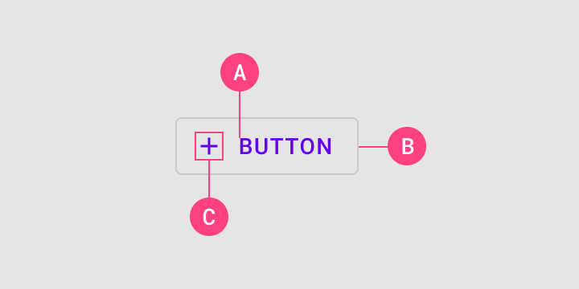
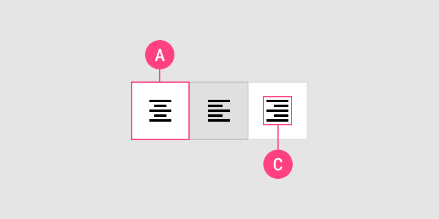

<!--docs:
title: "Buttons"
layout: detail
section: components
excerpt: "Android Buttons usage document"
ide_version: "<cIDE name> <compatible IDE version and build number>"
material_package_version: "<compatible Material platform package version number>"
iconId:
path: /
api_doc_root:
-->

# Buttons

[Buttons](https://material.io/components/buttons/) allow users to take actions, and make choices, with a single tap.

There are four types of buttons:

1. [Text button](#text-button)
2. [Outlined button](#outlined-button)
3. [Contained button](#contained-button)
4. [Toggle button](#toggle-button)


## Using buttons

Before you can use Material buttons, you need to add a dependency to the Material Components for Android library. For more information, go to the [Getting started](https://github.com/material-components/material-components-android/blob/master/docs/getting-started.md) page.

### Making buttons accessible

Android's button component APIs support labeling for accessibility. To use labels...

For more guidance on writing labels, go to [our page on how to write a good accessibility label](https://material.io/design/usability/accessibility.html#writing).

## Text button

[Text buttons](https://material.io/components/buttons/#text-button) are typically used for less-pronounced actions, including those located in dialogs and cards. In cards, text buttons help maintain an emphasis on card content.

### Text button example

API and source code:

* `MaterialButton`
    * [Class description](https://developer.android.com/reference/com/google/android/material/button/MaterialButton)
    * [GitHub source](https://github.com/material-components/material-components-android/blob/master/lib/java/com/google/android/material/button/MaterialButton.java)

The following example shows a text button with a text label.


In the XML layout:
```xml
<Button
    android:id="@+id/textButton"
    android:layout_width="wrap_content"
    android:layout_height="wrap_content"
    android:text="Text button"
    style="@style/Widget.MaterialComponents.Button.TextButton"
/>
```

_**Note:** `<Button>` is auto-inflated as `<com.google.android.material.button.MaterialButton>` via `MaterialComponentsViewInflater` when using a non-Bridge `Theme.MaterialComponents.*` theme._

In code:
```kt
textButton.setOnClickListener {
    // Respond to button press
}
```

### Anatomy and key properties

A text button has a text label, a transparent container and an optional icon.

<details>
<summary><b>Anatomy diagram</b></summary>
<br>


</details>

<details>
<summary><b>Attributes</b></summary>
<br>

<details>
<summary>Text label</summary>
<br>

|  | Attribute | Related method(s) | Default value |
| --- | --- | --- | --- |
| **Text label** | `android:text` | `setText`<br/>`getText` | `null` |
| **Color** | `android:textColor` | `setTextColor`<br/>`getTextColor` | `?attr/colorPrimary` |
| **Typography** | `android:textAppearance` | `setTextAppearance` | `?attr/textAppearanceButton` |

</details>

<details>
<summary>Container</summary>
<br>

|  | Attribute | Related method(s) | Default value |
| --- | --- | --- | --- |
| **Color** | `app:backgroundTint` | `setBackgroundColor`<br/>`setBackgroundTintList`<br/>`getBackgroundTintList` | `@android:color/transparent` |
| **Stroke color** | `app:strokeColor` | `setStrokeColor`<br/>`setStrokeColorResource`<br/>`getStrokeColor` | `null` |
| **Stroke width** | `app:strokeWidth` | `setStrokeWidth`<br/>`setStrokeWidthResource`<br/>`getStrokeWidth` | `0dp` |
| **Shape** | `app:shapeAppearance` | `setShapeAppearanceModel`<br/>`getShapeAppearanceModel` | `?attr/shapeAppearanceSmallComponent` |
| **Elevation** | `app:elevation` | `setElevation`<br/>`getElevation` | `0dp` |
| **Ripple color** | `app:rippleColor` | `setRippleColor`<br/>`setRippleColorResource`<br/>`getRippleColor` | `?attr/colorPrimary` at 12% opacity (pressed) |

</details>

<details>
<summary>Icon</summary>
<br>

|  | Attribute | Related method(s) | Default value |
| --- | --- | --- | --- |
| **Icon** | `app:icon` | `setIcon`<br/>`setIconResource`<br/>`getIcon` | `null` |
| **Color** | `app:iconTint` | `setIconTint`<br/>`setIconTintResource`<br/>`getIconTint` | `?attr/colorPrimary` |
| **Size** | `app:iconSize` | `setIconSize`<br/>`getIconSize` | `wrap_content` |
| **Gravity** (position relative to text label) | `app:iconGravity` | `setIconGravity`<br/>`getIconGravity` | `start` |
| **Padding** (space between icon and text label) | `app:iconPadding` | `setIconPadding`<br/>`getIconPadding` | `4dp` |

</details>

See the full list of [attrs](https://github.com/material-components/material-components-android/blob/master/lib/java/com/google/android/material/button/res/values/attrs.xml).

</details>

<details>
<summary><b>Styles</b></summary>
<br>

|  | Style |
| --- | --- |
| **Default style** | `Widget.MaterialComponents.Button.TextButton` |
| **Icon style** | `Widget.MaterialComponents.Button.TextButton.Icon` |

See the full list of [styles](https://github.com/material-components/material-components-android/blob/master/lib/java/com/google/android/material/button/res/values/styles.xml).

Default style theme attribute: N/A

</details>

## Outlined button

[Outlined buttons](https://material.io/components/buttons/#outlined-button) are medium-emphasis buttons. They contain actions that are important, but aren’t the primary action in an app.

### Outlined button example

API and source code:

* `MaterialButton`
    * [Class description](https://developer.android.com/reference/com/google/android/material/button/MaterialButton)
    * [GitHub source](https://github.com/material-components/material-components-android/blob/master/lib/java/com/google/android/material/button/MaterialButton.java)
    
The following example shows an outlined button with a text label and stroked container.    


In the XML layout:
```xml
<Button
    android:id="@+id/outlinedButton"
    android:layout_width="wrap_content"
    android:layout_height="wrap_content"
    android:text="Outlined button"
    style="?attr/materialButtonOutlinedStyle"
/>
```

In code:
```kt
outlinedButton.setOnClickListener {
    // Respond to button press
}
```

### Anatomy and key properties

An outlined button has a text label, a stroked container and an optional icon.

<details>
<summary><b>Anatomy diagram</b></summary>
<br>



</details>

<details>
<summary><b>Attributes</b></summary>
<br>

<details>
<summary>Text label</summary>
<br>

|  | Attribute | Related method(s) | Default value |
| --- | --- | --- | --- |
| **Text label** | `android:text` | `setText`<br/>`getText` | `null` |
| **Color** | `android:textColor` | `setTextColor`<br/>`getTextColor` | `?attr/colorPrimary` |
| **Typography** | `android:textAppearance` | `setTextAppearance` | `?attr/textAppearanceButton` |

</details>

<details>
<summary>Container</summary>
<br>

|  | Attribute | Related method(s) | Default value |
| --- | --- | --- | --- |
| **Color** | `app:backgroundTint` | `setBackgroundColor`<br/>`setBackgroundTintList`<br/>`getBackgroundTintList` | `@android:color/transparent` |
| **Stroke color** | `app:strokeColor` | `setStrokeColor`<br/>`setStrokeColorResource`<br/>`getStrokeColor` | `?attr/colorOnSurface` at 12% opacity |
| **Stroke width** | `app:strokeWidth` | `setStrokeWidth`<br/>`setStrokeWidthResource`<br/>`getStrokeWidth` | `1dp` |
| **Shape** | `app:shapeAppearance` | `setShapeAppearanceModel`<br/>`getShapeAppearanceModel` | `?attr/shapeAppearanceSmallComponent` |
| **Elevation** | `app:elevation` | `setElevation`<br/>`getElevation` | `0dp` |
| **Ripple color** | `app:rippleColor` | `setRippleColor`<br/>`setRippleColorResource`<br/>`getRippleColor` | `?attr/colorPrimary` at 12% opacity (pressed) |

</details>

<details>
<summary>Icon</summary>
<br>

|  | Attribute | Related method(s) | Default value |
| --- | --- | --- | --- |
| **Icon** | `app:icon` | `setIcon`<br/>`setIconResource`<br/>`getIcon` | `null` |
| **Color** | `app:iconTint` | `setIconTint`<br/>`setIconTintResource`<br/>`getIconTint` | `?attr/colorPrimary` |
| **Size** | `app:iconSize` | `setIconSize`<br/>`getIconSize` | `wrap_content` |
| **Gravity** (position relative to text label) | `app:iconGravity` | `setIconGravity`<br/>`getIconGravity` | `start` |
| **Padding** (space between icon and text label) | `app:iconPadding` | `setIconPadding`<br/>`getIconPadding` | `4dp` |

</details>

See the full list of [attrs](https://github.com/material-components/material-components-android/blob/master/lib/java/com/google/android/material/button/res/values/attrs.xml).

</details>

<details>
<summary><b>Styles</b></summary>
<br>

|  | Style |
| --- | --- |
| **Default style** | `Widget.MaterialComponents.Button.OutlinedButton` |
| **Icon style** | `Widget.MaterialComponents.Button.OutlinedButton.Icon` |

See the full list of [styles](https://github.com/material-components/material-components-android/blob/master/lib/java/com/google/android/material/button/res/values/styles.xml).

Default style theme attribute: `?attr/materialButtonOutlinedStyle`

</details>

## Contained button

[Contained buttons](https://material.io/components/buttons/#contained-button) are high-emphasis, distinguished by their use of elevation and fill. They contain actions that are primary to your app.

### Contained button example

API and source code:

* `MaterialButton`
    * [Class description](https://developer.android.com/reference/com/google/android/material/button/MaterialButton)
    * [GitHub source](https://github.com/material-components/material-components-android/blob/master/lib/java/com/google/android/material/button/MaterialButton.java)

The following example shows a contained button with a text label and a filled container.


In the XML layout:
```xml
<Button
    android:id="@+id/containedButton"
    android:layout_width="wrap_content"
    android:layout_height="wrap_content"
    android:text="Contained button"
/>
```

In code:
```kt
containedButton.setOnClickListener {
    // Respond to button press
}
```

### Anatomy and key properties

A contained button has a text label, a filled container and an optional icon.

<details>
<summary><b>Anatomy diagram</b></summary>
<br>


</details>

<details>
<summary><b>Attributes</b></summary>
<br>

<details>
<summary>Text label</summary>
<br>

|  | Attribute | Related method(s) | Default value |
| --- | --- | --- | --- |
| **Text label** | `android:text` | `setText`<br/>`getText` | `null` |
| **Color** | `android:textColor` | `setTextColor`<br/>`getTextColor` | `?attr/colorOnPrimary` |
| **Typography** | `android:textAppearance` | `setTextAppearance` | `?attr/textAppearanceButton` |

</details>

<details>
<summary>Container</summary>
<br>

|  | Attribute | Related method(s) | Default value |
| --- | --- | --- | --- |
| **Color** | `app:backgroundTint` | `setBackgroundColor`<br/>`setBackgroundTintList`<br/>`getBackgroundTintList` | `?attr/colorPrimary` |
| **Stroke color** | `app:strokeColor` | `setStrokeColor`<br/>`setStrokeColorResource`<br/>`getStrokeColor` | `null` |
| **Stroke width** | `app:strokeWidth` | `setStrokeWidth`<br/>`setStrokeWidthResource`<br/>`getStrokeWidth` | `0dp` |
| **Shape** | `app:shapeAppearance` | `setShapeAppearanceModel`<br/>`getShapeAppearanceModel` | `?attr/shapeAppearanceSmallComponent` |
| **Elevation** | `app:elevation` | `setElevation`<br/>`getElevation` | `2dp` |
| **Ripple color** | `app:rippleColor` | `setRippleColor`<br/>`setRippleColorResource`<br/>`getRippleColor` | `?attr/colorOnPrimary` at 24% opacity (pressed) |

</details>

<details>
<summary>Icon</summary>
<br>

|  | Attribute | Related method(s) | Default value |
| --- | --- | --- | --- |
| **Icon** | `app:icon` | `setIcon`<br/>`setIconResource`<br/>`getIcon` | `null` |
| **Color** | `app:iconTint` | `setIconTint`<br/>`setIconTintResource`<br/>`getIconTint` | `?attr/colorOnPrimary` |
| **Size** | `app:iconSize` | `setIconSize`<br/>`getIconSize` | `wrap_content` |
| **Gravity** (position relative to text label) | `app:iconGravity` | `setIconGravity`<br/>`getIconGravity` | `start` |
| **Padding** (space between icon and text label) | `app:iconPadding` | `setIconPadding`<br/>`getIconPadding` | `4dp` |

</details>

See the full list of [attrs](https://github.com/material-components/material-components-android/blob/master/lib/java/com/google/android/material/button/res/values/attrs.xml).

</details>

<details>
<summary><b>Styles</b></summary>
<br>

|  | Style |
| --- | --- |
| **Default style** | `Widget.MaterialComponents.Button` |
| **Icon style** | `Widget.MaterialComponents.Button.Icon` |
| **Unelevated style** | `Widget.MaterialComponents.Button.UnelevatedButton` |
| **Unelevated icon style** | `Widget.MaterialComponents.Button.UnelevatedButton.Icon` |

See the full list of [styles](https://github.com/material-components/material-components-android/blob/master/lib/java/com/google/android/material/button/res/values/styles.xml).

Default style theme attribute: `?attr/materialButtonStyle`

</details>

## Toggle button

[Toggle buttons](https://material.io/components/buttons/#toggle-button) can be used to select from a group of choices.

There are two types of toggle buttons:

* [Toggle button](#toggle-button)
* [Icon](#icon)

### Toggle button

To emphasize groups of related toggle buttons, a group should share a common container.

#### Toggle button example

API and source code:

* `MaterialButtonToggleGroup`
    * [Class description](https://developer.android.com/reference/com/google/android/material/button/MaterialButtonToggleGroup)
    * [GitHub source](https://github.com/material-components/material-components-android/blob/master/lib/java/com/google/android/material/button/MaterialButtonToggleGroup.java)
* `MaterialButton`
    * [Class description](https://developer.android.com/reference/com/google/android/material/button/MaterialButton)
    * [GitHub source](https://github.com/material-components/material-components-android/blob/master/lib/java/com/google/android/material/button/MaterialButton.java)

The following example shows a toggle button with three buttons that have icons and no text labels.


In the XML layout:
```xml
<com.google.android.material.button.MaterialButtonToggleGroup
    android:id="@+id/toggleButton"
    android:layout_width="wrap_content"
    android:layout_height="wrap_content">
    <Button
        android:id="@+id/favoriteButton"    
        android:layout_width="wrap_content"
        android:layout_height="wrap_content"
        app:icon="@drawable/ic_favorite_24dp"
        style="@style/Widget.App.Button.OutlinedButton.IconOnly"
    />
    <Button
        android:id="@+id/removeRedEyeButton"
        android:layout_width="wrap_content"
        android:layout_height="wrap_content"
        app:icon="@drawable/ic_remove_red_eye_24dp"
        style="@style/Widget.App.Button.OutlinedButton.IconOnly"
    />
    <Button
        android:id="@+id/notificationsButton"
        android:layout_width="wrap_content"
        android:layout_height="wrap_content"
        app:icon="@drawable/ic_notifications_24dp"
        style="@style/Widget.App.Button.OutlinedButton.IconOnly"    
    />
</com.google.android.material.button.MaterialButtonToggleGroup>
```

In `res/values/styles.xml`:
```xml
<style name="Widget.App.Button.OutlinedButton.IconOnly" parent="Widget.MaterialComponents.Button.OutlinedButton">
    <item name="iconPadding">0dp</item>
    <item name="android:insetTop">0dp</item>
    <item name="android:insetBottom">0dp</item>
    <item name="android:paddingLeft">12dp</item>
    <item name="android:paddingRight">12dp</item>
    <item name="android:minWidth">48dp</item>
    <item name="android:minHeight">48dp</item>
</style>
```

In code:
```kt
toggleButton.addOnButtonCheckedListener { toggleButton, checkedId, isChecked ->
    // Respond to button selection
}
```

#### Anatomy and key properties

A toggle button has a text label <!-- seems like this may be a typo, and it's a container in most implementations --> an an icon.

<details><summary>Expand for anatomy diagram and key toggle button properties</summary>



**4. Toggle button**
* A Text label
* C Icon

##### Themes (Styles)

Description | Style
---|---
Default theme | `Widget.MaterialComponents.MaterialButtonToggleGroup`

</details>

### Icon

Icons can be used as toggle buttons when they allow selection, or deselection, of a single choice, such as marking an item as a favorite.

#### Icon example

Source code API:

* `CheckBox`
    * [Class description](https://developer.android.com/reference/android/widget/CheckBox)

The following example shows an icon that can be used independently or in items of a `RecyclerView`.


In the XML layout:
```xml
<CheckBox
    android:id="@+id/icon"
    android:layout_width="wrap_content"
    android:layout_height="wrap_content"
    android:button="@drawable/sl_favourite_24dp"
    app:buttonTint="@android:color/white"
/>
```

In `res/drawable/sl_favourite_24dp.xml`:
```xml
<selector>
    <item
        android:drawable="@drawable/ic_favourite_outlined_24dp" 
        android:state_checked="false"
    />
    <item
        android:drawable="@drawable/ic_favourite_filled_24dp" 
        android:state_checked="true"
    />
    <item android:drawable="@drawable/ic_favourite_outlined_24dp" />
</selector>
```

In code:

```kt
icon.setOnCheckedChangeListener { checkBox, isChecked ->
    // Respond to icon toggle     
}
```

#### Anatomy and key properties

The icon button consists of two icons for 'on' and 'off'.

<details><summary>Expand for anatomy diagram and key icon button properties</summary>

**Icon button**
* C Icon

Diagram label | Design Attribute |  Theme value |  Property
---|---|---|---
C | Icon | N/A | 
C | Icon color | Secondary color |  

We recommend using [Material Theming](https://material.io/components/buttons/#theming) to apply your customizations across your application. For a full list of component properties, go to the [Icon button API doc]()

##### Themes (Styles)

Description | Style
---|---
Default theme |

</details>
