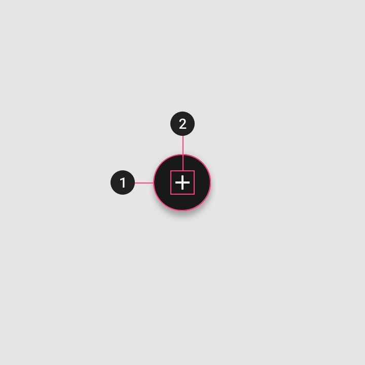

<!--docs:
title: "Buttons: floating action buttons"
layout: detail
section: components
excerpt: "Dialogs are modal windows that require interaction."
iconId: 
path: /catalog/FAB/
-->

# Buttons: floating action buttons

A floating action button (FAB) represents the primary action of a screen.

# Usage

A floating action button (FAB) performs the primary, or most common, action on a screen. It appears in front of all screen content, typically as a circular shape with an icon in its center. FABs come in three types: regular, mini, and extended.

Only use a FAB if it is the most suitable way to present a screen’s primary action.

### Install `MDCButtons`

MDCFloatingButton is a subclass of [MDCButton](ios-button.md) that implements the Material Design floating action button style and behavior. Floating action buttons should be provided with a templated image for their normal state and then themed accordingly.

Before using the `MDCButtons` API to implement its types you must install `MCDButtons`. In your source files import the component, and then apply your theme:
1. Install `MDCButtons`
   * Use CocoaPods to install `MDCButtons`
     1. Add the following line to your `Podfile`:
       ```java
      pod MaterialComponents/Buttons
       ```
     1. Run the installer:
       ```bash
       pod install
       ```
1. Import `MDCButtons` and MDC button theming and initialize `MDCButtons` using `alloc`/`init`. You will need to Initialize your theme  before applying it to your button.

    **Note** For more information about themes, go to the [Theming page](https://material.io/develop/ios/components/theming/) for iOS.
<!--<div class="material-code-render" markdown="1">-->
   **Swift**
   ```swift
   import MaterialComponents.MaterialButtons
   import MaterialComponents.MaterialButtons_Theming
   /*...*/
  let plusImage = UIImage(named: "plus").withRenderingMode(.alwaysTemplate)
  let floatingButton = MDCFloatingButton()
  floatingButton.setImage(plusImage, forState: .normal)
  floatingButton.applySecondaryTheme(withScheme: containerScheme)
   ```
   
   **Objective-C**
   ```objc
   #import "MaterialButtons.h"
   #import <MaterialComponentsBeta/MaterialButtons+Theming.h>
   /*...*/
   UIImage *plusImage =
    [[UIImage imageNamed:@"plus"] imageWithRenderingMode:UIImageRenderingModeAlwaysTemplate];
   MDCFloatingButton *floatingButton = [[MDCFloatingButton alloc] init];
   [floatingButton setImage:plusImage forState:UIControlStateNormal];
   [self.floatingButton applySecondaryThemeWithScheme: self.containerScheme];
   ```
<!--</div>-->

    For our examples, we used the following theming values:

<!--<div class="material-code-render" markdown="1">-->
   **Swift**
   ```swift
   let MyMaterialTheme = MDCContainerScheme()
   ```
   **Objective-C**
   ```objc
   MDCContainerScheme *MyMaterialTheme = [[MDCFloatingButton alloc] init]
   ```
<!--</div>-->


### Making FABs accessible
 
To help make your FABs usable to as many users as possible, apply the following:

* Set an appropriate [`accessibilityLabel`](https://developer.apple.com/documentation/uikit/uiaccessibilityelement/1619577-accessibilitylabel) value if your button does not have a title or only has an icon:
<!--<div class="material-code-render" markdown="1">-->
  **Objective-C**
  ```objc
  floatingButton.accessibilityLabel = @"Create";
  ```
  **Swift**
  ```swift
  floatingButton.accessibilityLabel = "Create"
  ```
<!--</div>-->

* Set the minimum [visual height to
36 and miniumum visual width to 64](https://material.io/design/components/buttons.html#specs)
<!--<div class="material-code-render" markdown="1">-->
  **Objective-C**

  ```objc
  floatingButton.minimumSize = CGSizeMake(64, 36);
  ```

  **Swift**

  ```swift
  floatingButton.minimumSize = CGSize(width: 64, height: 48)
  ```
<!--</div>-->


* Set the [touch areas to at least 44 points high and 44
wide](https://material.io/design/layout/spacing-methods.html#touch-click-targets).
    To minimize FAB's visual size while allowing for larger [touchable areas](https://material.io/design/layout/spacing-methods.html#touch-click-targets), set the `hitAreaInsets` to a negative value. Maintain sufficient distance between the FAB touch targets. For more see the [Touch and click
targets](https://material.io/design/layout/spacing-methods.html#touch-click-targets)
in the spec.
<!--<div class="material-code-render" markdown="1">-->
  **Objective C**
  ```objc
  CGFloat verticalInset = MIN(0, -(48 - CGRectGetHeight(fab.bounds)) / 2);
  CGFloat horizontalInset = MIN(0, -(48 - CGRectGetWidth(fab.bounds)) / 2);
  floatingButton.hitAreaInsets = UIEdgeInsetsMake(verticalInset, horizontalInset, verticalInset, horizontalInset);
  ```

  **Swift**
  ```swift
  let buttonVerticalInset =
  min(0, -(kMinimumAccessibleButtonSize.height - button.bounds.height) / 2);
  let buttonHorizontalInset =
  min(0, -(kMinimumAccessibleButtonSize.width - button.bounds.width) / 2);
  floatingButton.hitAreaInsets =
  UIEdgeInsetsMake(buttonVerticalInset, buttonHorizontalInset,
  buttonVerticalInset, buttonHorizontalInset);
  ```
<!--</div>-->

  _**Note** There are [some](https://material.io/design/components/buttons.html#toggle-button) clear [exceptions](https://material.io/design/components/app-bars-bottom.html#specs) for these rules. Please adjust your buttons sizes accordingly._

* **Optional** Set an appropriate `accessibilityHint`

    Apple rarely recommends using the `accessibilityHint` because the label should
    already be clear enough to indicate what will happen. Before you consider
    setting an `-accessibilityHint` consider if you need it or if the rest of your
    UI could be adjusted to make it more contextually clear.

    A well-crafted, thoughtful user interface can remove the need for
   `accessibilityHint` in most situations. Examples for a selection dialog to
    choose one or more days of the week for a repeating calendar event:

    *   (Good) The dialog includes a header above the list of days reading, "Event
    repeats weekly on the following day(s)." The list items do not need
    `accessibilityHint` values.
    *   (Bad) The dialog has no header above the list of days. Each list item
    (representing a day of the week) has the `accessibilityHint` value, "Toggles
    this day."


## Floating action button

You can apply a theme to the FAB using `Themes`.

Source Code APIs:

* MDCButton  (a subclass of [UIButton](https://developer.apple.com/documentation/uikit/uibutton))
    * [Class description](https://material.io/develop/ios/components/buttons/api-docs/Classes/MDCButton.html)
    * [GitHub source](https://github.com/material-components/material-components-ios/blob/develop/components/Buttons/src/MDCButton.h)
* [Themes class description](https://material.io/develop/ios/components/theming/)  <!-- This is slated to be deprected, though the examples from https://material.io/develop/ios/components/buttons/api-docs/Classes/MDCButton.html appear to use this class--> 


<!-- To do:
* add example code
* add example code render screenshot

### Anatomy and key properties

A FAB has a container and an icon.



1. Container
1. Icon

Tables can be copy/pasted from iOS-buttons.md when they're done 

<b>Container</b>

|  | Attribute | Related method(s) | Default value |
| --- | --- | --- | --- |
| **Color** |  |  | |
| **Stroke color** | |  | |
| **Stroke width** |  |  |  |
| **Shape** |  | | |
| **Elevation** | | | |
| **Ripple color** | | | | 

<b>Icon</b>

|  | Attribute | Related method(s) | Default value |
| --- | --- | --- | --- |
| **Color** |  | | |
| **Icon** | | | |
| **Size** | | | |
| **Gravity** (position relative to text label) | | | |
| **Padding** (space between icon and text label) | | | |

 to do:
Add Shrine theming example


## Theming buttons

FABs support [Material Theming](https://material.io/components/buttons/#theming) and can be customized in terms of color, typography and shape.

### FAB theming example

API and source code:

* `MaterialButton` (a subclass of [UIButton](https://developer.apple.com/documentation/uikit/uibutton))
    * [Class description](https://)
    * [GitHub source](https://github.com/material-components/)
    
The following example shows a FAB with Material Theming.


[Shrine theme](https://material.io/design/material-studies/shrine.html)

```
Include source code implementing FAB with a plus icon using "Shrine" theme.

Upload a screenshot of the render and update the image.
```
-->
