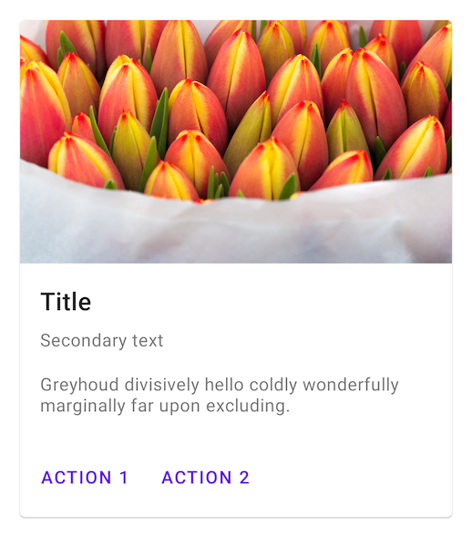
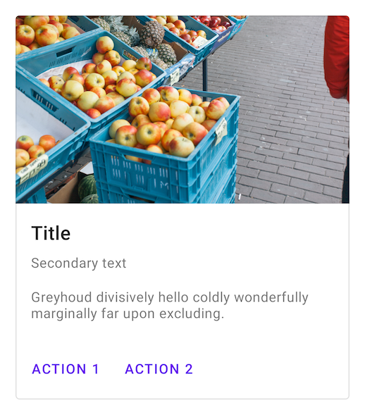
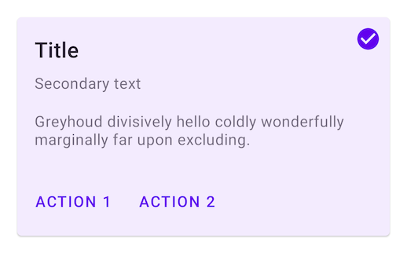
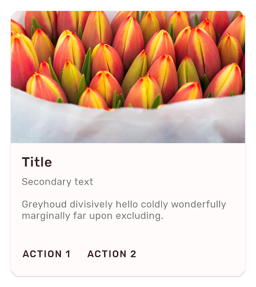

<!--docs:
title: "Cards"
layout: detail
section: components
excerpt: "Cards display content and actions on a single subject."
iconId: 
path: /catalog/cards/
-->

# Cards

[Cards](https://material.io/components/cards/) contain content and actions about a single subject.


## Using cards

Before you can use a Material card, you need to add a dependency to the Material Components for Android library. For more information, go to the [Getting started](https://github.com/material-components/material-components-android/blob/master/docs/getting-started.md) page.

Cards support [checking](#making-the-card-checkable) and [dragging](#making-the-card-draggable), but those behaviors are not implemented by default.

### Making cards accessible

The contents within a card should follow their own accessibility guidelines, such as images having content description set on them.

If you have a draggable card, you should set an [`AccessibilityDelegate`](https://developer.android.com/reference/android/view/View.AccessibilityDelegate) on it, so that the behavior can be accessible via screen readers such as TalkBack. More info about it under the [draggable card section](#making-the-card-draggable).

## Card

On mobile, a [card’s](https://material.io/components/cards/#specs) default elevation is 1dp, with a raised dragged elevation of 8dp.

### Card example

Source code API:

* `MaterialCardView`
  * [Class definition](https://developer.android.com/reference/com/google/android/material/card/MaterialCardView)
  * [Class source](https://github.com/material-components/material-components-android/tree/master/lib/java/com/google/android/material/card/MaterialCardView.java)

_**Note:** You don't need to specify a style tag as long as you are using a Material Components Theme. If not, set the style to `Widget.MaterialComponents.CardView`._

#### Elevated card

The following example shows an elevated card.



In the layout:

```xml
<com.google.android.material.card.MaterialCardView
    android:layout_width="@dimen/card_width"
    android:layout_height="wrap_content"
    android:layout_margin="8dp"
    android:clickable="true"
    android:focusable="true"
    android:minHeight="@dimen/card_min_height">

  <LinearLayout
      android:layout_width="match_parent"
      android:layout_height="wrap_content"
      android:orientation="vertical">

    <!-- Media -->
    <android.support.v7.widget.AppCompatImageView
        android:layout_width="match_parent"
        android:layout_height="194dp"
        android:background="@android:color/transparent"
        android:contentDescription="@string/media_image_view_description"
        app:srcCompat="@drawable/card_sample_image" />

    <!-- Title and supporting text -->
    <LinearLayout
        android:layout_width="match_parent"
        android:layout_height="wrap_content"
        android:orientation="vertical"
        android:padding="16dp">
      <TextView
          style="?attr/textAppearanceHeadline6"
          android:layout_width="wrap_content"
          android:layout_height="wrap_content"
          android:text="@string/card_title" />
      <TextView
          android:layout_width="wrap_content"
          android:layout_height="wrap_content"
          android:layout_marginTop="8dp"
          android:text="@string/secondary_text" />
      <TextView
          android:layout_width="wrap_content"
          android:layout_height="wrap_content"
          android:layout_marginTop="16dp"
          android:text="@string/supporting_text" />

      <!-- Buttons -->
      <LinearLayout
          android:layout_width="wrap_content"
          android:layout_height="wrap_content"
          android:layout_marginTop="8dp"
          android:orientation="horizontal">

        <com.google.android.material.button.MaterialButton
            style="?attr/borderlessButtonStyle"
            android:layout_width="wrap_content"
            android:layout_height="wrap_content"
            android:layout_marginEnd="8dp"
            android:layout_marginRight="8dp"
            android:text="@string/action_1" />

        <com.google.android.material.button.MaterialButton
            style="?attr/borderlessButtonStyle"
            android:layout_width="wrap_content"
            android:layout_height="wrap_content"
            android:layout_marginEnd="8dp"
            android:layout_marginRight="8dp"
            android:text="@string/action_2" />

      </LinearLayout>
    </LinearLayout>

  </LinearLayout>

</com.google.android.material.card.MaterialCardView>
```

#### Outlined card

The following example shows an outlined card.



In the layout:

```xml
<com.google.android.material.card.MaterialCardView
    ...
    app:strokeWidth="1dp"
    app:strokeColor="@color/gray"
    app:cardElevation="0dp">
        ...
        <!-- Card contents (same as elevated card example). -->

</com.google.android.material.card.MaterialCardView>
```

#### Making the card checkable



When a card is checked, it will show a checked icon and change the foreground color. There is no default behavior for enabling/disabling the checked state. An example of how to do it in response to a long click is shown below.

In the layout:

```xml
<com.google.android.material.card.MaterialCardView
    ...
    android:clickable="true"
    android:focusable="true"
    android:checkable="true">
    ...
</com.google.android.material.card.MaterialCardView>
```

In code:

```kt
card.setOnLongClickListener {
    card.setChecked(!card.isChecked)
    true
}
```

#### Making the card draggable

Cards have an `app:state_dragged` that has foreground and elevation changes to convey motion. We recommend using  [`ViewDragHelper`](https://developer.android.com/reference/androidx/customview/widget/ViewDragHelper) to set the dragged state:

```kt
private inner class ViewDragHelperCallback : ViewDragHelper.Callback() {

    override fun onViewCaptured(capturedChild: View, activePointerId: Int) {
        if (capturedChild is MaterialCardView) {
          (view as MaterialCardView).setDragged(true)
        }
    }

    override fun onViewReleased(releaseChild: View, xVel: Float, yVel: Float) {
        if (releaseChild is MaterialCardView) {
          (view as MaterialCardView).setDragged(false)
        }
    }
}
```

Alternatively, the [Material Catalog](https://github.com/material-components/material-components-android/tree/master/catalog/java/io/material/catalog/card) has an implementation example that uses a custom class called [`DraggableCoordinatorLayout`](https://github.com/material-components/material-components-android/blob/master/catalog/java/io/material/catalog/draggable/DraggableCoordinatorLayout.java) that you can copy, which is used as the parent container in the layout:

```xml
<io.material.catalog.draggable.DraggableCoordinatorLayout
    android:id="@+id/parentContainer"
    ...
    >

    <com.google.android.material.card.MaterialCardView
        ...
        >
        <!-- Card contents. -->
    </com.google.android.material.card.MaterialCardView>
  
</io.material.catalog.draggable.DraggableCoordinatorLayout>
```

Then, in code:

```kt
parentContainer.addDraggableChild(card)

parentContainer.setViewDragListener(object : DraggableCoordinatorLayout.ViewDragListener {

    override fun onViewCaptured(view: View, pointerId: Int) {
        card.isDragged = true
    }

    override fun onViewReleased(view: View, vX: Float, vY: Float) {
        card.isDragged = false
    }
})
```

Finally, make sure to make the behavior is accessible by setting an [`AccessibilityDelegate`](https://developer.android.com/reference/android/view/View.AccessibilityDelegate) on the card. The following shows an example of allowing the user to move the card to two different positions on the screen.

```kt
private val cardDelegate = object : AccessibilityDelegate() {
    override fun onInitializeAccessibilityNodeInfo(host: View, info: AccessibilityNodeInfo) {
        super.onInitializeAccessibilityNodeInfo(host, info)

        val layoutParams = card!!.layoutParams as CoordinatorLayout.LayoutParams
        val gravity = layoutParams.gravity
        val isOnTop = gravity and Gravity.TOP == Gravity.TOP
        val isOnBottom = gravity and Gravity.BOTTOM == Gravity.BOTTOM

        if (!isOnTop) {
            info.addAction(AccessibilityAction(R.id.move_card_top_action, getString(R.string.card_action_move_top)))
        }
        if (!isOnBottom) {
            info.addAction(AccessibilityAction(R.id.move_card_bottom_action, getString(R.string.card_action_move_bottom)))
        }
    }

    override fun performAccessibilityAction(host: View, action: Int, arguments: Bundle): Boolean {
        val gravity: Int
        if (action == R.id.move_card_top_action) {
            gravity = Gravity.TOP
        } else if (action == R.id.move_card_bottom_action) {
            gravity = Gravity.BOTTOM
        } else {
            return super.performAccessibilityAction(host, action, arguments)
        }

        val layoutParams = card!!.layoutParams as CoordinatorLayout.LayoutParams
        if (layoutParams.gravity != gravity) {
            layoutParams.gravity = gravity
            card!!.requestLayout()
        }

        return true
    }
}
```

_**Note:** Cards also support a swipe-to-dismiss behavior through the use of ['SwipeDismissBehavior'](https://github.com/material-components/material-components-android/blob/master/lib/java/com/google/android/material/behavior/SwipeDismissBehavior.java). You can see an example [here](https://github.com/material-components/material-components-android/blob/master/catalog/java/io/material/catalog/card/CardSwipeDismissFragment.java)._


### Key properties


1. Container
2. Thumbnail (optional)
3. Header text (optional)
4. Subhead (optional)
5. Media (optional)
6. Supporting text (optional)
7. Buttons (optional)
8. Icons (optional)

_**Note:** All the optional elements of a card's content (with the exception of the optional checked icon) are implemented through the use of other views/components, as shown in the [card example](#card-example) section._

#### Container attributes

| &nbsp;  | Attribute | Related method(s) | Default value |
|---|---|---|---|
|Margin (left) | `android:layout_marginLeft` | N/A | N/A (recommended: `8dp`) |
|Margin (right)| `android:layout_marginRight` | N/A | N/A (recommended: `8dp`) |
|Margin (top)| `android:layout_marginTop` | N/A | N/A (recommended: `8dp`) |
|Elevation | `app:cardElevation` | `setCardElevation`<br/>`setCardMaxElevation` | `1dp` |
|Stroke color | `app:strokeColor` | `setStrokeColor`<br/>`getStrokeColor`<br/>`getStrokeColorStateList` | `@null` |
|Stroke width | `app:strokeWidth` | `setStrokeWidth`<br/>`getStrokeWidth` | `0dp` |
|Background color | `app:cardBackgroundColor` | `setCardBackgroundColor`<br/>`getCardBackgroundColor` | `?attr/colorSurface` |
|Foreground color | `app:cardForegroundColor` | `setCardForegroundColor`<br/>`getCardForegroundColor` | `@android:color/transparent` (see all [states](https://github.com/material-components/material-components-android/blob/master/lib/java/com/google/android/material/card/res/color/mtrl_card_view_foreground.xml)) |
|Ripple color | `app:rippleColor` | `setRippleColor`<br/>`setRippleColorResource`<br/>`getRippleColor` | `?attr/colorOnSurface` at 20% opacity (see all [states](https://github.com/material-components/material-components-android/blob/master/lib/java/com/google/android/material/card/res/color/mtrl_card_view_ripple.xml)) |
|Shape | `app:shapeAppearance` | `setShapeAppearanceModel`<br/>`getShapeAppearanceModel` | `?attr/shapeAppearanceMediumComponent` |

_**Note** We recommend that cards on mobile have `8dp` margins. `android:layout_margin` needs to be set directly on a `View` in its layout and not included as part of a style._

_**Note** Without an `app:strokeColor`, the card will not render a stroked border, regardless of the `app:strokeWidth` value._

#### Checked icon (optional) attributes

| &nbsp;  | Attribute | Related method(s) | Default value |
|---|---|---|---|
| Icon | `checkedIcon` | `setCheckedIcon`<br/>`setCheckedIconResource`<br/>`getCheckedIcon` | [`@drawable/ic_mtrl_checked_circle.xml`](https://github.com/material-components/material-components-android/blob/master/lib/java/com/google/android/material/resources/res/drawable/ic_mtrl_checked_circle.xml) |
| Tint | `checkedIconTint` | `setCheckedIconTint`<br/>`getCheckedIconTint` | `?attr/colorPrimary` |
| To make card checkable | `android:checkable` | `setCheckable`<br/>`isCheckable` | `false` |

#### States

Cards have the following states:

| State  | Description | Related method(s) |
|---|---|---|
| Default | Card is not checked and not dragged | N/A |
| Checked (`android:state_checked`) | `true` if a card is checked  | `setChecked`<br/>`setOnCheckedChangeListener`<br/>`isChecked` |
| Dragged (`app:state_dragged`) | `true` when a card is being dragged | `setDragged`<br/>`isDragged` |

#### Styles

&nbsp;            | Style
----------------- | --------------------------------------------------
**Default style** | `Widget.MaterialComponents.CardView`

Default style theme attribute: `?attr/materialCardViewStyle`

See the full list of
[styles](https://github.com/material-components/material-components-android/blob/master/lib/java/com/google/android/material/card/res/values/styles.xml)
and
[attributes](https://github.com/material-components/material-components-android/blob/master/lib/java/com/google/android/material/card/res/values/attrs.xml).


## Theming a card

A card supports [Material Theming](https://material.io/components/cards/#theming) and can be customized in terms of color, typography and shape.

The following example shows a card using the Material [Shrine](https://material.io/design/material-studies/shrine.html) theme.



### Card theming example

API and source code

* `MaterialCardView`
  * [Class definition](https://developer.android.com/reference/com/google/android/material/card/MaterialCardView)
  * [Class source](https://github.com/material-components/material-components-android/tree/master/lib/java/com/google/android/material/card/MaterialCardView.java)

#### Implementing card theming

Using theme attributes and styles in `res/values/styles.xml` (themes all cards and affects other components):

```xml
<style name="Theme.App" parent="Theme.MaterialComponents.*">
    ...
    <item name="colorPrimary">@color/shrine_pink_100</item>
    <item name="colorOnPrimary">@color/shrine_pink_900</item>
    <item name="colorOnSurface">@color/shrine_pink_900</item>
    <item name="shapeAppearanceMediumComponent">@style/ShapeAppearance.App.MediumComponent</item>
</style>

<style name="ShapeAppearance.App.MediumComponent" parent="ShapeAppearance.MaterialComponents.MediumComponent">
    <item name="cornerFamily">cut</item>
    <item name="cornerSize">8dp</item>
</style>

<!-- You still need the individual card styles to change non-theme attributes, like strokeWidth, strokeColor, etc.
     See the example below. -->
```

or using default style theme attributes, styles and theme overlays (themes all buttons but does not affect other components):

```xml
<style name="Theme.App" parent="Theme.MaterialComponents.*">
    ...
    <item name="materialCardViewStyle">@style/Widget.MaterialComponents.CardView</item>
</style>

<style name="Widget.App.Card" parent="Widget.MaterialComponents.CardView">
    <item name="materialThemeOverlay">@style/ThemeOverlay.App.Card</item>
    <item name="shapeAppearance">@style/ShapeAppearance.App.MediumComponent</item>
</style>

<style name="ThemeOverlay.App.Card" parent="">
    <item name="colorPrimary">@color/shrine_pink_100</item>
    <item name="colorOnPrimary">@color/shrine_pink_900</item>
    <item name="colorOnSurface">@color/shrine_pink_900</item>
</style>
```

or using one of the styles in the layout (affects only this specific card):

```xml
<com.google.android.material.card.MaterialCardView
    ...
    style="@style/Widget.App.Card"
/>
```
