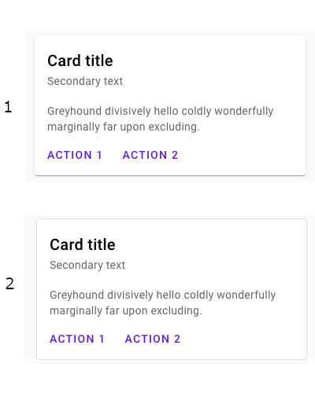

_**Instructions**_
* Copy this file into the platform folder for this component
* Rename the file to "\<platform\>-text-field.md"
* [Using cards](#using-cards)
    * Add a link under [Using cards](#using-cards) to your getting started page if you have one
    * Insert [installation](#installation) and [theming](#theming) as appropriate for your platform
    * Insert any additional instructions that apply to your platform with a separte level 3 header
    * If you have no getting started links or instructions, delete the [Using cards](#using-cards) sections
* [Elevated](#elevated-card) ane [Outlined](#outlined-card) sections
    * Add links to your platform 


# Cards

[Cards](https://material.io/components/cards/) contain content and actions about a single subject.

A card can be one of two types:
1. [Elevated](#elevated-card)
1. [Outlined](#outlined-card)

 |


## Using cards

If there are any instructions on using the component that applies to all component types (for example, installation or theming, accessiblity), include them here.

* Use an ordered list for ordered steps (`1.`)
* Use an unorered list for steps that have no particular order (`* `)

If there is a separate page that has instructions, link to that page.
<!-- What are the best ways to integrate component accessbility features into the template? -->

## Elevated card
 
On mobile, an [elevated card’s](https://material.io/components/cards/#specs) default elevation is 1dp, with a raised dragged elevation of 8dp.
### Key properties


**1. Elevated card attributes**

* A. 
* B. 
* C. 

\<**NOTE** Replace table descriptions with up to 6 attributes appropriate to your platform\>


<details>
<summary>Attribute A</summary>
<p>

Description | Attribute |  Default value | Related method(s)
---|---|---|---
Desc. 1 | | |
</p>
</details>

<details>
<summary>Attribute B</summary>
<p>

Description | Attribute | Default value | Related method(s)
---|---|---|---
Desc. 1 | | | 

</p>
</details>

<details>
<summary>Attribute C</summary>
<p>

Description | Attribute | Default value | Related method(s)
---|---|---|---
Desc. 1 | | | 

</p>
</details>

<details>
<summary><b>Themes (Styles)</b></summary>
<p>

Description | Theme
---|---
Default theme | 
Icon theme | 

</p>
</details>

### Elevated card example

Source code API:
* \<platform component name\>
  * [Class definition](https://)
  * [GitHub source](https://github.com/material-components/)


The following example shows an elevated card. The card has a title, a secondary title, text, and two actions: Action 1 and Action 2 in purple (#6200EE).

-elevated-card.png" alt="elevated card example for <platform> showing ...">

```
<source code here>
The source code example should display as per the interactive example (https://material.io/components/cards/#) with supporting text and Buttons, minus the media:
* Display an elevated card
* Display a card title "Card title" in black
* Display a secondary title "Secondary text" with an opacity of 60%
* Display text reading "Greyhound divisively hello coldly wonderfully marginally far upon excluding." with an opacity of 60%
* Display two actions, "Action 1" and "Action 2" the default purple of #6200EE
```


## Outlined card
 
On desktop and mobile, [outlined cards](https://material.io/components/cards/#specs) can have a resting elevation of 0dp. They elevate to 4dp on hover.
### Key properties


**1. Outlined card attributes**

* A. 
* B. 
* C. 

\<**NOTE** Replace table descriptions with up to 6 attributes appropriate to your platform\>


<details>
<summary>Attribute A</summary>
<p>

Description | Attribute |  Default value | Related method(s)
---|---|---|---
Desc. 1 | | |
</p>
</details>

<details>
<summary>Attribute B</summary>
<p>

Description | Attribute | Default value | Related method(s)
---|---|---|---
Desc. 1 | | | 

</p>
</details>

<details>
<summary>Attribute C</summary>
<p>

Description | Attribute | Default value | Related method(s)
---|---|---|---
Desc. 1 | | | 

</p>
</details>

<details>
<summary><b>Themes (Styles)</b></summary>
<p>

Description | Theme
---|---
Default theme | 
Icon theme | 

</p>
</details>

### Outlined card example

Source code API:
* \<platform component name\>
  * [Class definition](https://)
  * [GitHub source](https://github.com/material-components/)


The following example shows an outlined card. The card has a title, a secondary title, text, and two actions: Action 1 and Action 2 in purple (#6200EE).


-outlined-card.png" alt="outlined card example for <platform> showing ...">

```
<source code here>
The source code example should display as per the interactive example (https://material.io/components/cards/#) with supporting text and Buttons, minus the media:
* Display an outlined card with an outline of 60% opacity
* Display a card title "Card title" in black
* Display a secondary title "Secondary text" with an opacity of 60%
* Display text reading "Greyhound divisively hello coldly wonderfully marginally far upon excluding." with an opacity of 60%
* Display two actions, "Action 1" and "Action 2" the default purple of #6200EE

```

