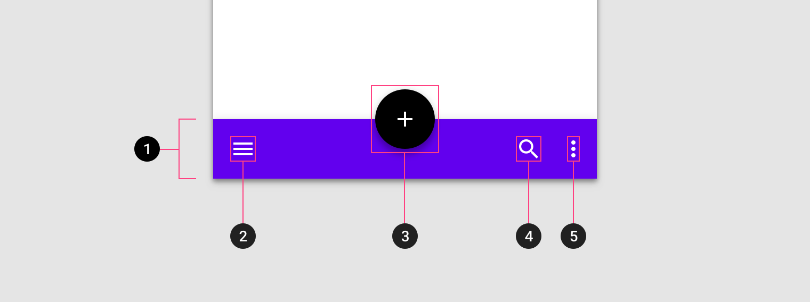

<!--docs:
title: "Material bottom app bar"
layout: detail
section: components
excerpt: "Bottom app bars provide access to a bottom navigation drawer and up to four actions, including the floating action button.
iconId: 
path: /catalog/material-bottom-app-bar/
-->

**Instructions to authors:**
* _Follow the instructions in each section &ndash; see the [accompanying examples](button-examples) for futher guidance._
* _Delete these instructions before submitting your document_


# Bottom app bars

[Bottom app bars](https://material.io/components/app-bars-bottom/) provide access to a bottom navigation drawer and up to four actions, including the floating action button.


## Using the bottom app bar

**Note to developers: please add a link to your platform's FAB article below**

Bottom app bars provide access to a bottom navigation drawer and up to four actions, including the [floating action button](link to floating action button here).

For more guidance using the bottom app bar, go to the [Material design page]((https://material.io/components/app-bars-bottom/)

### Install `AppBar`

**Note to developers: This stub was created assuming that the bottom app bar uses the same APIs as the top app bar. Please verify**
Before using the `AppBar` API to implement its types you must install `AppBar`. In your source files import the component, and then apply your theme:

1. Install `AppBar`
   * Use CocoaPods to install `AppBar`<!-- What are the correct packages? AppBar is listed as deprecated further along the original doc -->
     1. Add the following line to your `Podfile`:
       ```java
      pod MaterialComponents/AppBar
       ```
     1. Run the installer:
       ```bash
       pod install
       ```
1. Import `AppBar` and MDC app bar theming and initialize `Appbar` using `alloc`/`init`. Initialize your theme  before applying it to your app bar.

  **Note** For more information about themes, go to the [Theming page](https://material.io/develop/ios/components/theming/) for iOS.

    <!--<div class="material-code-render" markdown="1">-->
   **Swift**
   ```swift
   import MaterialComponents.MaterialAppBar
   import MaterialComponents.MaterialAppBar_Theming
   /*...*/
   // Apply your app's Container Scheme to the App Bar controller
   let containerScheme = MDCContainerScheme()

   // Either Primary Theme
   appBarViewController.applyPrimaryTheme(withScheme: containerScheme)

   // Or Surface Theme
   appBarViewController.applySurfaceTheme(withScheme: containerScheme)
   ```
     
   **Objective-C**
   ```objc
   #import "MaterialButtons.h"
   #import <MaterialComponentsBeta/MaterialButtons+Theming.h>
   /*...*/
   // Apply your app's Container Scheme to the App Bar controller
   MDCContainerScheme *containerScheme = [[MDCContainerScheme alloc] init];

   // Either Primary Theme
   [self.appBarController applyPrimaryThemeWithScheme:containerScheme];

   // Or Surface Theme
   [self.appBarController applySurfaceThemeWithScheme:containerScheme];
   ```
   <!--</div>-->


### Making the bottom app bar accessible

Because the app bar mirrors the state of your view controller’s `navigationItem`, making an app bar accessible often does not require any extra work.

The following examples demonstrate how to apply accessibility settings to your app bar:

<!--<div class="material-code-render" markdown="1">-->

**Swift**
```swift
self.navigationItem.rightBarButtonItem =
    UIBarButtonItem(title: "Right", style: .done, target: nil, action: nil)

print("accessibilityLabel: \(self.navigationItem.rightBarButtonItem.accessibilityLabel)")
// Prints out "accessibilityLabel: Right"
```

**Objective-C**
```objc
self.navigationItem.rightBarButtonItem =
   [[UIBarButtonItem alloc] initWithTitle:@"Right"
                                    style:UIBarButtonItemStyleDone
                                   target:nil
                                   action:nil];

NSLog(@"accessibilityLabel: %@",self.navigationItem.rightBarButtonItem.accessibilityLabel);
// Prints out "accessibilityLabel: Right"
```
<!--</div>-->


## Bottom app bar example

`<API name>`
* [Class definition](link to API documentation)
* [GitHub source](link to source in the Material.io GitHub repo)
* [Demo](Link to demo app site)

**Note to developers: Please add example source and a screenshot that renders the bottom app bar with the following features:**
* Leading navigation drawer
* Overlapping FAB with '+' icon in the center
* Trailing 'search' and overflow menu control

## Anatomy and key properties




1. Container
1. Navigation drawer control
1. Floating action button (FAB)
1. Action icon
1. Overflow menu control

### Container attributes

|  | Attribute | Related method(s) | Default value |
| --- | --- | --- | --- |
| **Color** | | | |
| **Stroke color** | | | |
| **Stroke width** | | | |
| **Shape** | | | |
| **Elevation** | | | |
| **Ripple color** | | | |

### Navigation icon attributes

|  | Attribute | Related method(s) | Default value |
| --- | --- | --- | --- |
| **Icon** | | | |
| **Color** | | | |
| **Size** | | | |
| **Gravity** (position relative to text label) | | | |
| **Padding** (space between icon and text label) | | | |

### FAB attributes
**Note to developers: Do you want to link the FAB dev doc?**

|  | Attribute | Related method(s) | Default value |
| --- | --- | --- | --- |
| **Text label** | | | |
| **Color** | | | | 
| **Typography** | | | |

### Action item attributes

|  | Attribute | Related method(s) | Default value |
| --- | --- | --- | --- |
| **Icon** | | | |
| **Color** | | | |
| **Size** | | | |
| **Gravity** (position relative to text label) | | | |
| **Padding** (space between icon and text label) | | | |

### Overflow menu attributes

|  | Attribute | Related method(s) | Default value |
| --- | --- | --- | --- |
| **Icon** | | | |
| **Color** | | | |
| **Size** | | | |
| **Gravity** (position relative to text label) | | | |
| **Padding** (space between icon and text label) | | | |


## Theming

### Theming example

**Note to developers: please add example source and screenshot using the [Shrine](https://material.io/design/material-studies/shrine.html) with the following features:**
* Leading navigation drawer
* Inset FAB with '+' icon in the center
* Trailing 'search', 'favorite', and overflow menu control


