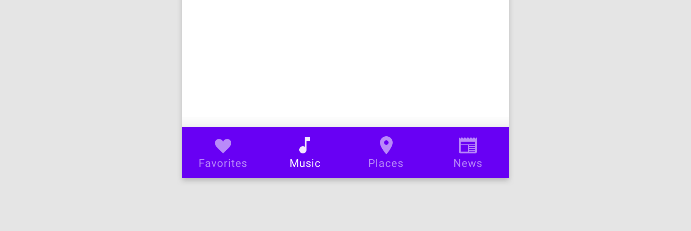

<!--docs:
title: "Bottom navigation"
layout: detail
section: components
excerpt: "Bottom navation bars allow movement between primary distinations in an app"
iconId:
path: /components/bottom-navigation/
-->


# Bottom navigation

[Bottom navigation](https://material.io/components/bottom-navigation/#) bars allow movement between primary destinations in an app.




## Using bottom navigation


## Bottom navigation example

Source code API:

_**Note to developers: link to approprite sites as applicable**_ 

* `BottomNavigationBar`
    * [Class description](https://api.flutter.dev/flutter/material/BottomNavigationBar-class.html)
   <!--
    * [GitHub source](https://github.com/materials-components/)
    * [Demo site](demo site link here) -->

The following example shows a bottom navigation bar with four icons:

* favorites
* music note
* places
* news

-bottom-nav.png" alt="bottom navigation bar with favorites, music note, places, and news icons">

```
<code snippet here>
The source code should render the following:
* bottom navigation bar with purple fill (#6200EE)
* four icons:
    * favorites
    * music note
    * places (not part of material.io icons)
    * news (not part of material.io icons)
* active icon should show up as white
* inactive icons should be show a 60% opacity
```

### Anatomy and key properties

The following is an anatomy diagram for the bottom navigation bar:


1. Container
1. Inactive icon
1. Inactive text label
1. Active icon
1. Active text label

**Container attributes**

| &nbsp; | Property |
| --- | --- |
| **Color** | `color` |
| **Stroke color** | N/A |
| **Stroke width** | N/A |
| **Shape** | `shape` |
| **Elevation** | `elevation` |
| **Ripple color** | `splashColor` |
| **Disabled color** | `disabledColor` |
| **Disabled elevation** | `disabledElevation` |


**Inactive icon attributes**

| &nbsp; | Property |
| --- | --- |
| **Icon** | `icon` |
| **Color** | `color` on `icon` |
| **Size** | `size` on `icon` |


**Inactive text label attributes**

| &nbsp; | Property |
| --- | --- |
| **Text label** | `child` |
| **Color** | `textColor` |
| **Disabled Text Color** | `disabledTextColor` |
| **Typography** | `style` on `child` or `label` |

**Active icon attributes**

| &nbsp; | Property |
| --- | --- |
| **Icon** | `icon` |
| **Color** | `color` on `icon` |
| **Size** | `size` on `icon` |


**Active text label attributes**

| &nbsp; | Property |
| --- | --- |
| **Text label** | `child`|
| **Color** | `textColor` |
| **Disabled Text Color** | `disabledTextColor` |
| **Typography** | `style` on `child` or `label` |

## Theming a bottom nav bar

_**Note to developers: Use the [Shrine theme](https://material.io/design/material-studies/shrine.html) for this example**_

```
<code snippet here>
The source code should render the following:
* bottom navigation bar
* four icons:
    * favorites
    * music note
    * places (not part of material.io icons)
    * news (not part of material.io icons)
```

