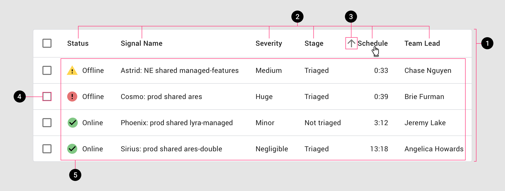

<!--docs:
title: "Data tables"
layout: detail
section: components
excerpt: "Data tables display information in a grid-like format of rows and columns."
iconId: 
path: /catalog/data-tables/
api_doc_root: true
-->

# Data tables

[Data tables](https://material.io/components/data-tables/#) display sets of data across rows and columns.

## Using data tables

Data tables display information in a grid-like format of rows and columns. They organize information in a way that’s easy to scan, so that users can look for patterns and insights.

Data tables can contain:

* Interactive components (such as chips, buttons, or menus)
* Non-interactive elements (such as badges)
* Tools to query and manipulate data

### Making data tables accessible

Flutter's text field component APIs supports both label text and helper text for accessibility. 

For more guidance on writing labels, go to [our page on how to write a good accessibility label](https://material.io/design/usability/accessibility.html#writing).

## Data tables

**Note to developers: provide source code and screenshot for an example data table the following properties**
**
* 5 columns
* 5 rows
* Top row consists of a checkbox followed by "Header A", "Header B" ... "Header D"
* First column consists of checkboxes
* Cells labeled "Cell A1" ... "Cell D4" numbered like the hero image

### Key properties

The following is an anatomy diagram of a data table:

A data table consists of the following properties:

1. Container
1. Column header names
1. Sort button
1. Row checkboxes
1. Rows

**Note to developers: check through all the below tables entries for accuracy. These attributes were copy/pasted from the text fields dev doc**

<b>Container</b>

| &nbsp; | Property | 
| --- | --- | 
| **Color** | style |
| **Stroke color** | `decoration`, inside `decoration` set the parameter `border`: `disabledBorder`, `enabledBorder`, `errorBorder`, `focusedBorder`, `focusedErrorBorder`|
| **Stroke width** | `decoration`, inside `decoration` set the parameter `border`: `disabledBorder`, `enabledBorder`, `errorBorder`, `focusedBorder`, `focusedErrorBorder`|
| **Shape** | decoration, inside `decoration` set the parameter `border`: `disabledBorder`, `enabledBorder`, `errorBorder`, `focusedBorder`, `focusedErrorBorder`|
| **Elevation** | N/A|
| **Ripple color** | N/A|

<b>Column header names</b>

| &nbsp; | Property |
| --- | --- | 
| **Label text** | Use `decoration`, within `decoration` set `labelText` property |
| **Typography** | Use `decoration`, within `decoration` set `labelStyle` property |
| **Color** | Use `decoration`, within `decoration` set `labelStyle` property |

<b>Sort button</b>

| &nbsp; | Property |
| --- | --- | 
| **\<attribute\>** | Use ... |

<b>Row checkboxes</b>

| &nbsp; | Property |
| --- | --- | 
| **\<attribute\>** | Use ... |

<b>Rows</b>

| &nbsp; | Property |
| --- | --- | 
| **\<attribute\>** | Use ... |

## Theming data tables
**Note to developers: _Use the [Shrine theme](https://material.io/design/material-studies/shrine.html) for this example_**
* Provide a screenshot of rendering code that uses "Shrine" theming colors and shapes for the data table example
* Provide source code that renders the screenshot of the theming example

