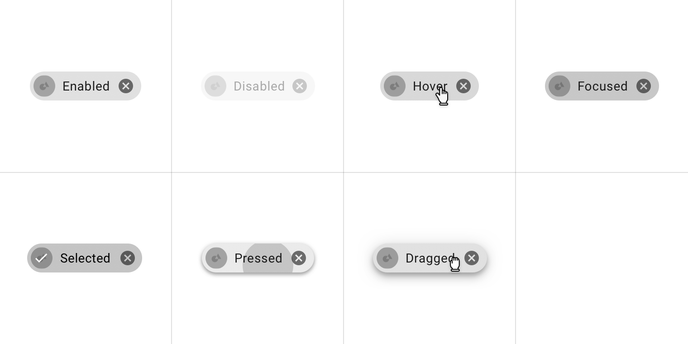

# Developement article accessibility examples and guidelines

This document shows the accessibility expectations for the deveoper-focused documents written in GitHub-flavored MarkDown, and focuses on best practices for writing introductory text and alt-text for image and diagram alt-text.

## Introductory text and alt-text

MarkDown has a limited palette of accessibility tools, and has no native image caption capability.

The introductory text should succintly describe the image within the context of the document.

The alt-text should describe relevant visual details, as though the image didn't load. Avoid alt-text over 125 characters because many optical character readers (OCRs) do not support long alt-text. If you feel you need the extra description (such as for composite images), the information may belong below the image as either a list of component images or a table.

## Image examples

Images for developer articles are screenshots to illustrate component types or render sample code. 

For example, if an image illustrates a type, the introductory text would be part of the document introduction and the alt-text would be succint because the customizations would be described elsewhere:

> The text field class consists of the following types:
>
> 1. [Filled text](#filled-text)
> 1. [Outlined text](#outlined-text)
>
> 

The alt-text reads:

	Text field examples of filled and outlined types with inactive and focused states.

If an image is a render from sample code, you should describe what was included in the introductory text, and describe the color and relative position of any attributes.

> The following is an example of a bottom application bar with icons and an overlapping floating action button:
>
> 

The alt-text reads:

	Purple bottom app bar with white icons: menu icon on left, search and more icons on right.
	Black FAB in center, overlapped.

## Diagram examples

Diagrams are usually screenshots that include callouts to convey specific technical information, but can include videos and animations. MarkDown does not natively support embedded video content, but can support animated GIFs.

Anatomy diagrams will have callouts for their assets. Instead of mentioning all the assets, list them below the diagram and keep the alt-text brief. For example the following is an introduction and diagram for a dialog component:

> The following is the anatomy diagram for the dialog component:
>
> 
>
> 1. Container
> 1. Title (optional)
> 1. Supporting text
> 1. Buttons
> 1. Scrim
>
>

The alt-text reads:

	Dialog component anatomy

State diagrams will show examples of all available states for a specific component. If your article needs to illustrate multiple states, then consider describing the states and their related assets and methods in a table and keeping the alt-text brief.

> The following shows all the available states for a chip:
> 
>
> | State | Assets | Related methods| Default setting |
> | --- | --- | --- | --- |
> | Enabled| left icon right icon container | | NA NA secondary color |
> | Disabled| left icon right icon container | | NA NA secondary color, 30% |
> | Hover| left icon right icon container | | NA NA secondary color |
> | Focused| left icon right icon container | | NA NA secondary color |
> | Selected | left icon right icon container | | NA NA secondary color |
> | Pressed| left icon right icon container ripple | | NA NA secondary color, 30% secondary color |
> | Dragged | left icon right icon container elevation | | NA NA secondary color 3pt |

