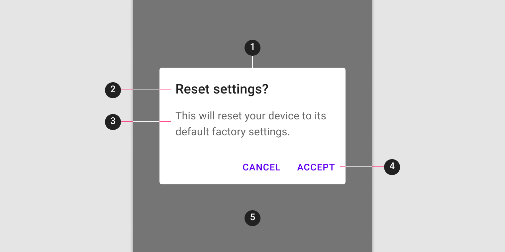
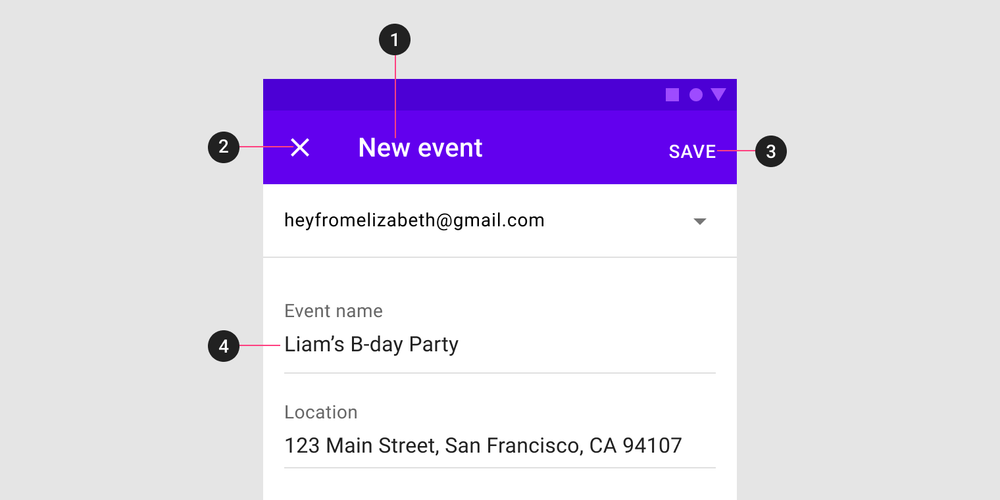

<!--docs:
title: "Dialogs"
layout: detail
section: components
excerpt: "Dialogs are modal windows that require interaction."
iconId: 
path: /catalog/dialog/
-->

# Dialogs

Dialogs inform users about a task and can contain critical information, require decisions, or involve multiple tasks.

There are four types of dialogs:

1. [Alert](#alert-dialog)
1. [Simple](#simple-dialog)
1. [Confirmation](#confirmation-dialog)
1. [Full-screen](#full-screen-dialog)

 

1. 
1. 
1. 
1. 

## Using dialogs

A dialog is a type of modal window that appears in front of app content to provide critical information or ask for a decision. Dialogs disable all app functionality when they appear, and remain on screen until confirmed, dismissed, or a required action has been taken.

Dialogs are purposefully interruptive, so they should be used sparingly.

### Making dialogs accessible

__Note to developers: Do the dialogs include any dialog-specific accessibility info?__

## Alert dialog

Alert dialogs interrupt users with urgent information, details, or actions.

### Alert dialog example

`AlertDialog`
* [Class description](https://github.com/material-components/material-components-android/tree/master/lib/java/com/google/android/material/dialog/MaterialAlertDialogBuilder.java)
* [API reference](https://developer.android.com/reference/android/app/AlertDialog)

### Alert dialog anatomy and key properties

The alert dialog contains the following:

1. Container
1. Title (optional)
1. Supporting text
1. Buttons
1. Scrim

**Container attributes**

| &nbsp; | **Attribute** | **Related methods**  | **Default value** |
| --- | --- | --- | --- |
| **Color** | | | |
| **Stroke color** | | | |
| **Stroke width** | | | |
| **Shape** | | | |
| **Elevation** | | | |
| **Ripple color** | | | |

**Title attributes**

| &nbsp; | **Attribute** | **Related methods**  | **Default value** |
| --- | --- | --- | --- |
| **Text label** | | | |
| **Color** | | | |
| **Typography** | | | |

**Supporting text attributes**

| &nbsp; | **Attribute** | **Related methods**  | **Default value** |
| --- | --- | --- | --- |
| **Text label** | | | |
| **Color** | | | |
| **Typography** | | | |

**Buttons attributes**

| &nbsp; | **Attribute** | **Related methods**  | **Default value** |
| --- | --- | --- | --- |
| | | | |

**Scrip attributes**

| &nbsp; | **Attribute** | **Related methods**  | **Default value** |
| --- | --- | --- | --- |
| | | | |

**Styles**

| &nbsp; | **Style** |
| --- | --- |
| **Default style** | |
| **Icon style** | |
 
## Simple dialog

Simple dialogs can display items that are immediately actionable when selected. They don’t have text buttons.

As simple dialogs are interruptive, they should be used sparingly. Alternatively, dropdown menus provide options in a non-modal, less disruptive way.

### Simple dialog example

### Simple dialog anatomy and key properties

A simple dialog contains the following:

## Confirmation dialog

Confirmation dialogs give users the ability to provide final confirmation of a choice before committing to it, so they have a chance to change their minds if necessary.

If the user confirms a choice, it’s carried out. Otherwise, the user can dismiss the dialog. For example, users can listen to multiple ringtones but only make a final selection upon tapping “OK.”

### Confirmation dialog example

### Confirmation dialog anatomy and key properties

A confirmation dialog contains the following:

## Full-screen dialog

Full-screen dialogs group a series of tasks, such as creating a calendar entry with the event title, date, location, and time. Because they take up the entire screen, full-screen dialogs are the only dialogs over which other dialogs can appear.dia

### Full-screen dialog example

### Full-screen dialog anatomy and key properties

The full-screen dialog contains the following properties:

## Dialog theming

### Dialog theming example

__**Note to developers** Provide an example with the following features using the [Shrine theme](https://material.io/design/material-studies/shrine.html#about-shrine)__
* Create a simple dialog
* Add a title "Title"
* Add 3 radio buttons with the following options:
  * "option 1"
  * "option 2"
  * "option 3"
* Add two text buttons to the bottom:
  * "Action 1"
  * "Action 2"
* Use the [Cards](https://github.com/mingjane-work/doc-material-components/blob/mingjane-doc-branch/cards-examples/Android/assets/cards_theming.png) themed image as the scrim
