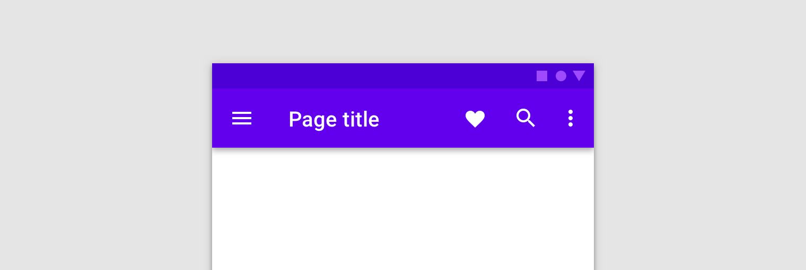

<!--docs:
title: "Top app bar"
layout: detail
section: components
excerpt: "<Platform name> top app bar"
latest_update: "<date of last update>"
iconId:
path: /
api_doc_root:
-->

**Instructions to authors:**
* _Add metadata in the top comment structure for Material.io site integration. Do not add `path` information &ndash; the usage docs should remain on one level_
* _Follow the instructions in each section &ndash; see the [accompanying examples](button-examples) for futher guidance._
* _Delete these instructions before submitting your document_

# Top app bar

The [top app bar](https://material.io/components/app-bars-top/#) displays information and actions relating to the current screen.

There are two types of top app bar:

1. [Regular top app bar](#regular-top-app-bar)
1. [Contextual top app bar](#contextual-top-app-bar)
 

1. 
1. 

## Using the top app bar

The top app bar provides content and actions related to the current screen. It’s used for branding, screen titles, navigation, and actions.

A regular top app bar can transform into a contextual action bar.

### Making the top app bar accessible

List any accessiblity setting or attributes (such as labels), describe how to use them and link to any guidelines on the m.io site (for example, [how to write a good accessibility label for your component](https://material.io/design/usability/accessibility.html#writing))

## Regular top app bar

Start with a concise (1-2 sentence) description of the component type.
* If possible, copy the exact summary from the design article.
* Link the first mention of the component type to the appropriate section of the design article.

### Regular top app bar example
Include a list of links to API documentation and source location of the component.

* Use the class/implementation names when linking to the API docs.
* Add other links as necessary if they would help using the component.
* Describe how to use this component type in as much detail as necessary.
* If your platform does not support a particular type, include the type but explicitly state that it isn't supported.
* If support is planned, link to the issue tracking that feature request.

Describe the example in 1-2 sentences.

Include an image of the rendered example.

Include a snippet of source code illustrating the example.

* Remove boilerplate code that is not necessary to understand the example.
* Consider highlighting the most important lines of the example.

### Anatomy and Key properties

* Call out the anatomy elements in a sentence.

<b>Expand for < component name > anatomy diagram and key properties</b>

* Insert the a diagram of the component type's anatomy. Use the anatomy diagram from the https://material.io/components/ site.
* Add a table of the design attributes represented by the diagram. Limit the design attributes to six items of the most commonly customized attributes.
* Include the following sentence below the table pointing the user to the API doc(s):
    "We recommend using [Material Theming](https://material.io/components/\<component name\>/#theming) to apply your customizations across your application. For a full list of component properties, go to the API docs:"
    * List the links to each API

#### Styles

Include a table of the theme description for each theme element and the theme's name in your platform. 

## Contextual top app bar
...

### Contextual top app bar example

...

### Anatomy and Key properties

<b>Expand for < component name > anatomy diagram and key properties</b>

...

_Continue describing the rest of the component types as necessary._

## Theming \<component name\>

Provide a 1-2 sentences saying that Material theming applies to the component:
    "\<Component name\> supports [Material Theming](https://material.io/components/<component name>/#theming) and can be customized in terms of color, typography and shape."

### \<Component name\> theming example

* Provide a screenshot of a coponent type that uses a modified theme that includes changes to:
    * Background color
    * Outline color (if applicable)
    * Font type
    * Font color
    * Component shape (if applicable)

<b>Implementing \<component name\> theming</b>

Provide example code that corresponds to the component type screenshot

